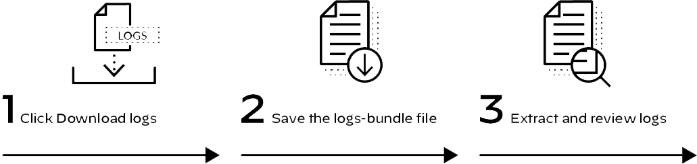

# Demisto - Useful documentation
Some useful but not well documented stuff on Demisto aka Cortex XSOAR by Palo Alto Networks

## Table of Contents
- [Demisto - Useful documentation](#demisto---useful-documentation)
  - [Table of Contents](#table-of-contents)
- [File System, Health Monitoring, and Logs](#file-system-health-monitoring-and-logs)
  - [Primary Directory Locations](#primary-directory-locations)
    - [/var/lib/demisto/](#varlibdemisto)
    - [/usr/local/demisto/](#usrlocaldemisto)
  - [Cortex XSOAR Directory Locations for Key Assets](#cortex-xsoar-directory-locations-for-key-assets)
  - [Health Monitoring](#health-monitoring)
  - [Cortex XSOAR Troubleshooting Logs](#cortex-xsoar-troubleshooting-logs)
    - [Debug](#debug)
    - [Info](#info)
    - [Warning](#warning)
  - [Log File Downloads](#log-file-downloads)
    - [1. Click Download logs.](#1-click-download-logs)
    - [2. Save the logs-bundle file and/or locate saved file.](#2-save-the-logs-bundle-file-andor-locate-saved-file)
    - [3. Extract and review logs.](#3-extract-and-review-logs)
  - [Files in the Logs Bundle](#files-in-the-logs-bundle)
    - [Running Log Files](#running-log-files)
    - [Status Output Logs](#status-output-logs)
- [Content Management](#content-management)
  - [What Is Cortex XSOAR Platform Content?](#what-is-cortex-xsoar-platform-content)
  - [Content Management](#content-management-1)
  - [Content Update Status](#content-update-status)
    - [Internet-Connected Systems](#internet-connected-systems)
    - [Disconnected Systems](#disconnected-systems)
  - [RBAC Permissions Required to Perform Content Updates](#rbac-permissions-required-to-perform-content-updates)
    - [Governance](#governance)
    - [Permissions](#permissions)
    - [Limitations](#limitations)
  - [How to Update Content](#how-to-update-content)
  - [Custom Content Import and Export](#custom-content-import-and-export)
    - [Export](#export)
    - [Import](#import)
    - [Use Case](#use-case)
- [Dev-Prod Deployment](#dev-prod-deployment)
    - [Development Server](#development-server)
    - [Production Server](#production-server)
  - [Dev-Prod Deployment Implementation](#dev-prod-deployment-implementation)
  - [Dev-Prod Deployment and Configuration](#dev-prod-deployment-and-configuration)
- [Backup and Restore](#backup-and-restore)
  - [Backup and Disaster Recovery Options](#backup-and-disaster-recovery-options)
      - [Automated Backups](#automated-backups)
      - [Live Backup](#live-backup)
    - [How to Configure Automated Backups](#how-to-configure-automated-backups)
      - [OFF/ON](#offon)
      - [Backups Directory](#backups-directory)
      - [Backup Time](#backup-time)
      - [Retention Settings](#retention-settings)
    - [How to Use an Automated Backup File to Roll Back the System](#how-to-use-an-automated-backup-file-to-roll-back-the-system)
  - [Live Backup Solution](#live-backup-solution)
      - [Active primary server](#active-primary-server)
      - [Standby server](#standby-server)
      - [Failover process](#failover-process)
  - [How to Deploy Live Backup: Configure the Primary Server](#how-to-deploy-live-backup-configure-the-primary-server)
  - [How to Deploy Live Backup: Configure the Live Backup Server](#how-to-deploy-live-backup-configure-the-live-backup-server)
  - [Use of Live Backup Failover Capability](#use-of-live-backup-failover-capability)
- [Official Documentation](#official-documentation)

# File System, Health Monitoring, and Logs
- Identify the file structure that Cortex XSOAR uses for software and data
- Define what to look for to confirm that the platform is working properly
- Describe the structure of the log file and the contents of the log bundle

## Primary Directory Locations
You should be aware of two primary directory locations.
### /var/lib/demisto/


The **/var/lib/demisto/** directory contains system files and subdirectories that are variable, or subject to change. This directory is the root directory for artifacts, attachments, backups, the incidents database, downloads, jobs, version control data, and other dynamic data.

### /usr/local/demisto/


The **/usr/local/demisto/** directory contains the application-server binary file, the private and public keys for the web interface, the license file, baseline platform content (resource files), and other distributed support files for running the web interface and other core functions.

## Cortex XSOAR Directory Locations for Key Assets
The following table lists several key assets and their directory locations for a standard Cortex XSOAR installation.


## Health Monitoring
To display high-level metrics for disk, CPU, and memory usage, navigate to the **Home [Dashboards] > System Health** page. 
The page displays updated information every 60 seconds. Look for yellow and red indicators for disk, CPU, or memory use. 
The default page refresh is every 10 minutes. 

The color for disk, CPU, and memory changes from green to yellow at 51% used and from yellow to red at 81% used. 

- Green indicates that baseline platform resources are sufficient for normal operation.
- Yellow indicates a condition to monitor relative to current performance and anticipated growth in system use and data storage.
- Red indicates that remediation steps should be assessed, especially with regard to disk use.

## Cortex XSOAR Troubleshooting Logs
You can use the Cortex XSOAR web interface to set the level of detail that the platform writes to its application log files. You also can use the web interface to download a copy of the log files. 

Log controls are located at the top of the **Settings > About > Troubleshooting** page.

### Debug
Debug causes the system to write many logs about the operational outcome of many procedural processes and subprocesses. 
The debug level is resource intensive. You typically should set the log level to debug only on advice from the technical support or customer success teams and/or problem-specific documentation.

### Info
Info is the default setting. It records events that are informative about general operational status and health. The info level includes all warning-level messages.

### Warning
Warning is the least active log level. It records only those events that indicate errors and failures or potential errors and failures.

## Log File Downloads
Perform the following steps to generate and download log files. 



### 1. Click Download logs.
Go to the **Settings > Troubleshooting** page and click **Download logs**. After you click **Download logs**, the browser makes a URL request to **https://<server-name-or-IP-address>/log/bundle**. 

### 2. Save the logs-bundle file and/or locate saved file. 
The URL request causes the application server to create a log bundle and return to the browser a tarball that contains the prepared logs. Your web browser will handle the download file based on its standard methods and your user settings.
The format of the name of the logs bundle is **logs-bundle-\<DD>\<MMM>\<YY>\<HH>_\<SS>\<ZZZ>.tar.gz**.

Note that the hours value <HH> directly follows the two-digit year value <YY>, which makes the combined values look like a four-digit year value.

The filename **logs-bundle-14Jul2004_50EDT.tar.gz** would be created for a Download logs request executed on 14 July, 2020 at 04:50 AM Eastern Daylight Time.

### 3. Extract and review logs.
To display the contents of the tarball, use your preferred graphical archive manager or Linux CLI tools. Basic Linux commands are as follows:

- The **tar -tf \<filename>** command lists the filenames within the archive. 

- The **tar -xvzf \<filename>** command extracts the files and the **/var/lib/demist/temp/bundle<#########>/** directory structure to the current working directory.

## Files in the Logs Bundle
The Cortex XSOAR logs bundle contains over 20 individual log files. Some log files are copies of running logs to which the system writes operational information over time. Some logs provide copies of status output that the system generates at the time the log bundle is requested.

### Running Log Files
Some files in the log bundle are copies of log files that the system writes to continuously over time or for a period of time, such as during system boot or during an update.


### Status Output Logs
Some files in the log bundle are copies of log files that the system writes to continuously over time or for a period of time, such as during system boot or during an update.


# Content Management

This section describes content management in the Cortex XSOAR environment. 
- Define platform content
- Describe the content management lifecycle
- Find content status indicators and content update tools
- Identify permissions required to view and use content update functions
- Use the custom content import and export functions 
- Identify the supported dev-prod topology and how to deploy it

## What Is Cortex XSOAR Platform Content?
Palo Alto Networks creates, updates, deprecates, and removes platform content from distribution in the form of content updates. Platform content excludes program code that provides core functionality and data structures that store incident data.

Cortex XSOAR platform content includes script files, descriptors, and configuration information. Below are examples.


The image shows a partial list of raw filenames in a content update package. 


## Content Management
Palo Alto Networks continuously develops new content and typically releases new content every few weeks.


  **Note**: The diagram illustrates the basic content lifecycle for content developed by Palo Alto Networks or by your own organization. 

  To simplify the presentation of the lifecycle concept, various sub-processes, such as design, quality-assurance testing, acceptance, and other details, such as beta cycles, are not depicted. 


**Develop / Improve**

  The development of new content and the improvement of old content drives the momentum of the lifecycle. To separate development activity from production use of the system, you can deploy an additional Cortex XSOAR server and use it exclusively for development and content management.


**Manage and Distribute**

  Version control and distribution is typically managed by use of a Git repository. Palo Alto Networks content updates are distributed via GitHub. You can perform private content distribution in two ways: 
    1) manually by use of web-interface features and/or Linux command-line tools, or 
    2) by use of a dev-prod configuration to help automate the management of a private Git repository.


**Use in Production**

  After the production server is updated with new content from the default Palo Alto Networks Cortex XSOAR public GitHub repository, from a  configured private repository, or by a manual process, the content is ready for use on the primary server and any attached Cortex XSOAR engine servers.


**Assess**

  Ongoing assessment of performance and utility may result in the deprecation, removal, improvement, or replacement of distributed content. Deprecated content is not removed from distribution, but such content is flagged as “deprecated,” which means that the content is usable but is obsolete, best avoided, and typically superseded by a redesigned version in the current release package.


## Content Update Status
Keeping up to date with new content is important. New content may expand the general capability of the platform, implement new support for specific use cases, optimize current script files, provide bug fixes, and/or add support for changes to third-party products and services. Content updates for internet-connected systems and disconnected systems differ. 

### Internet-Connected Systems

  For internet-connected systems, the web interface displays content update status in the top-right of the **Reports**, **Playbooks**, **Automation**, and **Settings** pages.

### Disconnected Systems

  For disconnected systems, you must manage content manually by downloading the latest content update from GitHub and then using the web console to upload the content package.


## RBAC Permissions Required to Perform Content Updates
Governance, permissions, and limitations determine role based access control permissions to perform content updates. Click the arrows for more information.


### Governance

  The display of the content update status and access to the upload (cloud icon), **Check for new content**, and **Install new content** functions is governed by RBAC permissions.  

### Permissions

  Users with read/write permissions for **Investigations > Data, Scripts, and Playbooks** will have the following privileges: 

- Display of the update-status text
- Display of the drop-down information panel
- Use of the upload, check, and install functions at the bottom of the information panel

### Limitations

  If a user has all three read/write permissions (**Investigations > Data, Scripts, and Playbooks**) but does does not have permission to view one or more of the Reports, Playbooks, Automation, and Settings pages, the system will display the update status on each page that is permitted.


## How to Update Content
Clicking the content status text displays an information panel. The panel shows release notes for the most recent update or a pending update if it is available. The panel also shows the **Check for new content** and the **Install new content** control buttons (if new content is available) to upload packages manually.


To update content on internet-connected systems, perform the following steps. 


## Custom Content Import and Export
Local system users (if their role-based privileges allow) may create, update, deprecate, or remove an organization’s own custom and customized platform content on local systems by use of the web interface. Custom content **Import** and **Export** buttons are at the bottom of the **Settings > About > Troubleshooting** page. 


### Export

  You can export all custom content that users have created.


### Import

  You can import custom content that has been exported from the same system or another Cortex XSOAR system.


### Use Case

  Typical use cases for importing and exporting custom content include:

  - transfer to other deployments for production use or for development and testing
  - initial manual synchronization for dev-prod configurations
  - backup and restore


# Dev-Prod Deployment
This section provides an overview of the dev-prod topology and an outline of the process required to implement the dev-prod feature set.  

  Cortex XSOAR includes a dev-prod feature set and associated topology that you can use to support the separation of development and production systems. The system’s built-in dev-prod capability enables you to utilize a development server and a production server. 


### Development Server

  Use a development server to control content in a private repository.


### Production Server

  Configure the production server to use that repository as its sole source for all new or updated content.


## Dev-Prod Deployment Implementation
To implement dev-prod configurations you must first contact the customer support and/or the customer-success team to accomplish the following three tasks. Click the cards for more information. 

- Confirm that your use case, deployment plans, and dev-prod workflows match the capabilities of the solution design.

- Confirm access to the latest step-by-step instructions.

- Get the name of the custom server configuration parameter that causes dev-prod configuration options to display in the web console.

## Dev-Prod Deployment and Configuration
The Dev-Prod deployment and configuration is done in five steps, as outlined in the following sections. 

1. Create the remote repository

The repository must have a minimum of one branch. You can clone or branch content from another repository or start empty. Consult current documentation, and check with the customer success team for recommendations and important details.


2. Pre-configure the dev server

Use custom-content import and/or standard update functions to configure the dev server with all content that you want to replicate to the remote repository and then to the production server. (Actual requirements and recommendations vary.)


3. Sync dev server and remote repository

To sync the dev server and the remote repository, perform the following steps on the dev server. 


3.1. Backup custom content.

At the bottom of the **Settings > About > Troubleshooting** page, click **Export**.

**Warning**: If you do not export (back up) your custom data, errors in the configuration of the Git repository or other errors made in the synchronization process can result in permanent data loss.


3.2. Add a custom server configuration.

Use the **Settings > About > Troubleshooting** page to add a custom configuration parameter that enables the display of the **Settings > Advanced > Content Repository** page. As of publication, you must contact the customer success or support team for the required custom configuration parameter.


3.3. Configure the Content Repository parameters.

Go to the **Settings > Advanced > Content Repository** options: Set the **Private content repository** to **ON**; set **This server is** to **Development**; add the **Repository URL**, **SSH key**, and **SSH key passphrase**; select the **Git repository Branch**; and click **Save**.


4. Sync the prod server and remote repository

To sync the prod server and the remote repository, perform the following steps on the dev server. 


4.1. Backup custom content.

At the bottom of the **Settings > About > Troubleshooting** page, click **Export**. This step is a safety measure. You should have already exported any custom content that you may have developed on the target prod server and imported that content into the dev server. 

**Warning**: Any content on the prod server that is not already present in the remote repository will be deleted after you configure and save the dev-prod configuration on the prod server. After you set a dev-prod configuration on a prod server, all content edit features on the prod server are disabled.


4.2. Add the custom server configuration.

Use the **Settings > About > Troubleshooting** page to add the custom configuration parameter that enables the display of the **Settings > Advanced > Content Repository** page.


4.3. Configure the content repository parameters.

Go to the **Settings > Advanced > Content Repository** options: Set **Private content repository** to **ON**; set **This server is** to **Production**; add **Repository URL**, **SSH key**, and **SSH key passphrase**; select the **Git repository Branch**; and click **Save**.


4.4. Accept content to discard.

Review the notification in the **Discard server changes** dialog box, which lists any content on the prod server that does not exist in the remote repository. Enter **Discard** in the text box below the prompt and click **Continue**.


5. Verify your results

Finally, review the available content and confirm changes in functionality, such as the inability to edit content by use of the dev server.


# Backup and Restore

This section describes Backup and Restore in the Cortex XSOAR environment.

- Describe and configure the basic Automated Backups feature
- Identify the directories excluded by Automated Backups that can be backed up manually or by use of Live Backup
- Explain how Live Backup supports availability and disaster-recovery needs
- Configure an instance of Live Backup
- Describe the restoration process


## Backup and Disaster Recovery Options
Cortex XSOAR provides two backup-related solutions for replication and storage of system data and settings: Automated Backups and Live Backup. Both solutions can be used, and in most cases should be used, simultaneously.

#### Automated Backups

- Function
  - Makes daily copies of incidents, playbooks, scripts, and user-defined configurations 
  - Does not duplicate artifacts and attachments

- Configuration
    - Download the required packages and transfer them to a local instance of a YUM software repository that you configure on the target server.

- Primary Use Case
  - To preserve data and to enable on-demand system rollback by use of basic features

- Consideration
    - Rollback requires use of the Linux command line to stop the application service and to replace the database files from a selected archive.


#### Live Backup 
- Function
  - Mirrors data in real time from the primary server to a standby server
  - Includes replication of artifacts and attachments

- Configuration
  - The web interface provides partial configuration capability, after you apply a custom server configuration.
  - The initial setup of the standby server requires manual database replication via the Linux command line. 
  
- Primary Use Case
  - To enable manual failover in response to a platform failure or environmental outage
  
- Considerations
  - A second server and installation of the Cortex XSOAR Server software are required.
  - Failover requires administrator use of the web interface or the Linux command line and the manual redirection of user connections.


### How to Configure Automated Backups
To view and/or edit the Automated Backups configuration, go to Settings > Advanced > Backups. Any change you make to a parameter displayed in a text box is saved immediately after you navigate from the edited parameter.

#### OFF/ON
  
Artifacts and Attachments repositories are typically large. Duplication of them on the host file system would rapidly consume disk space. Palo Alto Networks recommends the use of your standard backup tools for HA-DR recovery of the following directories: **/var/lib/demisto/artifacts/** and **/var/lib/attachments/**. Also, consider deployment of a Live Backup solution.


#### Backups Directory

Palo Alto Networks recommends the additional use of your standard backup tools for HA-DR recovery of the backups directory (default: **/var/lib/demisto/backup/**).


#### Backup Time

Click the current time value to display a drop-down configuration tool. Change the time and click **Save**.


#### Retention Settings
  
A backup file available on the local server instead of on a remote repository can save time. Consider the following factors for any change to your retention values: frequency of system changes, level of risk, database size, available disk space, and (if implemented) the reliability and availability of remote backups.


### How to Use an Automated Backup File to Roll Back the System
Manually download and installation of Docker images is done in five steps. Note that you will need an internet-connected workstation to complete the first three steps.


1. Stop the application service.
    ```
    sudo service demisto stop
    ```

2. Delete the contents of the database directory (default: **/var/lib/demisto/data/**).
    ```
    sudo rm -r /var/lib/demisto/data/*
    ```

3. Use a target backup file to refresh the system.

     a. Copy the target backup file to the database directory.

     b. Use **tar -xzf <backup-filename-.gzip>** to extract the backup.

     c. Move all **demisto_XXXXX.db** files (not including **demisto.db**) to the **/var/lib/demisto/partitionsData** folder.

    


4. Start the application service.
    ```
    sudo service demisto start
    ```

5. Log in to the web interface and validate the rollback.


## Live Backup Solution
The Live Backup solution runs two Cortex XSOAR server instances simultaneously: an active primary server and a backup server. Each server maintains a distinct IP address and hostname.

#### Active primary server
The primary server runs all automations and serves all users.

#### Standby server
The standby server receives ongoing system changes from the primary server, but is not available to users until you manually change its mode to active.

#### Failover process
The failover process is manual. After manual failover, any Cortex XSOAR engines will automatically start to connect to the new active server.

**Note**: As of publication, high-availability features that are not supported include multiple primary and standby servers, active-active configuration, peer monitoring, and use of virtual IP addresses (VIPs).


## How to Deploy Live Backup: Configure the Primary Server
The following steps summarize the process for setting up a Live Backup solution. 


1. Add a custom server configuration.

    
    Go to **Settings > About > Troubleshooting > Server Configuration**, add the server-configuration key **ui.livebackup**, set the value to **True**, and then click **Save**. This configuration enables the display of Live Backup options in the web interface.

2. Set Live Backup to ON. 

    Go to **Settings > Advanced > Backups** and click the **OFF/ON** toggle to set it to **ON**.

3. Configure the Live Backup settings.

    
    Add required server information and then click **Save Live Backup configuration**.

4. Log in to the Linux command shell and stop the application service.
    ```
    sudo service demisto stop
    ```

5. Use the **tar** command to back up the following folders and ensure all files and folders retain **demisto:demisto** ownership.
    ```
    /var/lib/demisto/data

    /var/lib/demisto/artifacts

    /var/lib/demisto/attachments

    /var/lib/demisto/systemTools

    /var/lib/demisto/d2_server.key

    /usr/local/demisto/cert*

    /usr/local/demisto/demisto.lic
    ```

    This command creates a tarball named **xsoarBackup.tgz**:

    ```
    sudo tar --ignore-failed-read -pczf xsoarBackup.tgz /var/lib/demisto/data /var/lib/demisto/artifacts /var/lib/demisto/attachments /var/lib/demisto/systemTools /var/lib/demisto/d2_server.key /usr/local/demisto/cert* /usr/local/demisto/demisto.lic
    ```

6. Copy the tarball to the Live Backup server.
    
    Example use of the **scp** command:

    ```
    scp xsoarBackup.tgz <username>@<live-backup-IP-or-hostname>:<target-directory>
    ```


## How to Deploy Live Backup: Configure the Live Backup Server
The following steps summarize the process for setting up a Live Backup solution on the target Live Backup (standby) server. 


1. Install Cortex XSOAR server software.
    ```
    sudo sh ./demistoserver-xxxx.sh -- -dr -do-not-start-server
    ```
    
    The “**--**” option passes the subsequent options to the binary installer. 

    The disaster recovery option “**-dr**” enables Live Backup mode. 

    The “**-do-not-start-server**” option causes the installer to finish without starting the application service.

2. Verify connectivity from the primary server to the standby server.
   
    Use the following command ("**curl**" instead of "**wget**" is intentional):
    ```
    curl -k https://<IP-addr-or-DNS-name>
    ```

3. Extract the backup tarball.
   
    Use the command to preserve file permissions and ownership: 

    ```
    sudo tar -C / -xzpvf xsoarBackup.tgz
    ```


4. Start the application service.
    ```
    sudo service demisto start
    ```

5. Go to the primary server and start the application service.
    ```
    sudo service demisto start
    ```

## Use of Live Backup Failover Capability
Live Backup supports failover scenarios that may result from platform failure (hardware or software), infrastructure outage, or environmental disaster. The image shows how a standby server splash page is displayed after you log in to the standby server.


Use the product Admin Guide and information available on the support site for up-to-date and detailed instructions for the following tasks:

- Live Backup failover testing
- Perform failover with a recoverable active (primary) server
- Perform failover with an unrecoverable active (primary) server

# Official Documentation

Use the latest
- [Cortex XSOAR Admin Guide](https://docs.paloaltonetworks.com/cortex/cortex-xsoar/6-0/cortex-xsoar-admin.html) 

and information available on the 

- [Demisto support site](https://support.demisto.com/hc/en-us) 
 
for up-to-date and detailed instructions for all available administrative tasks.
